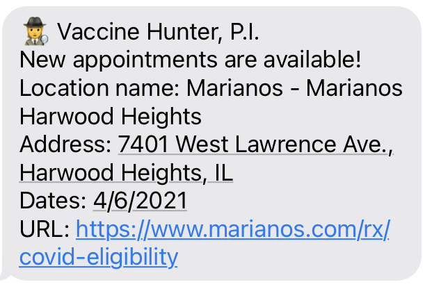

# vaccine-hunter
A thing I made to send notifications when COVID vaccine appointments open up. Uses vaccinespotter.org, which is 👌.



## Features
 - Runs at configurable frequency (cron recommended)
 - Supports multiple registrants, each with their own:
   - Phone number
   - Location
   - Search radius
   - Alert time window
   - Eligibility date
   - City exclusions
 - Sends notifications using iMessage or SMS (using AWS SNS)
 - Does not re-notify each phone number more than once for a particular vaccination location on a particular date/time
 - Sends admin notifications for successes and/or errors (Optional; uses AWS SES)

# Setup
I'm a node.js neophyte, I expect this is probably not ideal. But it works! 

Env:
 - Intel Mac (Big Sur)
 - node.js version 15.13.0

```
brew install node
npm install
npm install -g ts-node@9.1.1
```

## Sending SMS Notitifications with AWS SNS
If you want to send SMS notifications, set `notificationType` in the config to `"sms"` and make sure AWS is set up. This involves creating an account, generating API keys, and adding those keys in a `~/.aws/credentials` file.

SMS notifications with SNS are pretty cheap (less than $0.01 per message). That could technically add up if you configure a lot of registrants with large search areas, but you're not likely to spend huge sums here if you're just using it personally.

# Config
Copy `config_template.json` to `config.json` and fill out the fields.

# Running it
To run it once: `ts-node vaccine-hunter.ts`

To check every minute and log results to a file, create crontab line:
```
* * * * * cd <project_root> && mkdir -p log && npm install; /usr/local/bin/ts-node vaccine-hunter.ts >> log/$(/bin/date "+\%Y-\%m-\%d").log 2>&1
```
Note that using modern Mac OS, you need to grant disk access to `cron` if you want it to work. Also, the commands and files are path dependent and stuff.

# Caveats
 1. Not scalable! This is designed for a handful of registrants and a limited amount of time. The entire alert history is read into memory on each run, so if that gets big then things go bad.
 2. This is for moderately techy people. If you're comfortable on *NIX command line, you can probably make it work.

# Acknowledgements
Thanks to [@nickblah](https://twitter.com/nickblah) for vaccinespotter.org and the accompanying API. Just wow.
